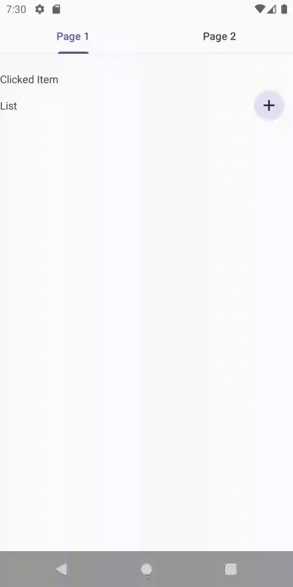

# RecyclerView/ListAdapter bug

## Problems

1. The order of the displayed list is different from the one supplied to ListAdapter.submitList
2. When the display error happens, the method ListAdapter.onBindViewHolder is called repeatedly and never stops. This causes serious performance and battery life problems.
3. When the display error happens, the ViewHolder UI freezes: touching the item view no longer triggers the onClickListener.

## The example program

A minimum example to reproduce the problem is available here:
https://github.com/dsoutw/Android-RecyclerView-Bug
The problem is tested on the emulator of API 30 and 34

### The function of the program

The program has a counter "myListSize" in MyListFragment with an initial value 0. Each time when the
user presses the add button
1. the counter increases by one, and
2. the program creates a list, labeled from 1 to "myListSize", and applied the list to "MyListAdapter.submitList".

If the user clicks an item on the list, the program will display the item on "clickedItem_text" (fragment_list.xml)

### Experiments

We run the program. The we repeat doing the two actions: 
1. tap the add button, and
2. tap the new item.

The program behaved correctly on the 1st, ..., and the 4th tap of the add button.

The program started to behave incorrectly from the 5th click.
On the 5th click, the list displays an incorrect order of items: 
```
1, 3, 2, 4, 5
```

And when tapping on the 5th item, the "clickedItem_text" does not update.

In fact, according to the dump on the logcat, we see that the ListAdapter repeated 
calling "onBindViewHolder" and never stopped.
```
2023-11-07 15:39:20.236 10334-10334 RuleSelect...istAdapter com.dsou.recyclerview                D  onBindViewHolder item=2 position=1
2023-11-07 15:39:20.237 10334-10334 RuleSelect...istAdapter com.dsou.recyclerview                D  onBindViewHolder item=3 position=2
2023-11-07 15:39:20.270 10334-10334 RuleSelect...istAdapter com.dsou.recyclerview                D  onBindViewHolder item=2 position=1
2023-11-07 15:39:20.271 10334-10334 RuleSelect...istAdapter com.dsou.recyclerview                D  onBindViewHolder item=3 position=2
2023-11-07 15:39:20.301 10334-10334 RuleSelect...istAdapter com.dsou.recyclerview                D  onBindViewHolder item=2 position=1
2023-11-07 15:39:20.302 10334-10334 RuleSelect...istAdapter com.dsou.recyclerview                D  onBindViewHolder item=3 position=2
```

Here is a recording of the result



## The structure of the views

The program has a hierarchy of views:
```
ConstraintLayout (main_layout activity_main.xml)
→ fragment (main_fragment activity_main.xml)
→ ConstraintLayout (fragment_layout fragment_main.xml)
→ ViewPager2 (view_pager fragment_main.xml)
→ ConstraintLayout (list_layout fragment_list.xml)
→ RecyclerView (my_list fragment_list.xml)
→ ConstraintLayout (item_layout holder_item.xml)
→ TextView (item_text holder_item.xml)
```

On "view_pager", we set
```
android:layout_width="match_parent"
```
and remove all horizontal constraints. We note that "view_pager" is a child of a ConstraintLayout.

On "item_text", we use a data binding expression
```
android:text="@{item.text}"
```

## Conditions that are required to reproduce the problem

### ConstraintLayout: need to apply "match_parent" to the child "view_pager"

On the view "view_pager", if we replace 
```
android:layout_width="match_parent"
```
by
```
android:layout_width="0dp"
```
and add the horizontal constraints, then the problems no longer exist.

This is on the branch [feature/ConstraintLayout_remove_match_parent](https://github.com/dsoutw/Android-RecyclerView-Bug/tree/feature/ConstraintLayout_remove_match_parent).

### ViewPager2: need to use a ViewPager2 to show the fragment "fragment_list.xml"

If we replace the ViewPager2 "view_pager" by a regular fragment, then the problems no longer exist.  

This is on the branch [feature/ViewPager2_replaced_by_fragment](https://github.com/dsoutw/Android-RecyclerView-Bug/tree/feature/ViewPager2_replaced_by_fragment).

### Data binding: need to use data binding to display the item label in "holder_item.xml"

If we replace
```
binding.item = item
```
by 
```
binding.itemText.text = item.text
```
in "MyListAdapter.kt", and remove all data binding statements in "holder_item.xml", then the problem
no longer exists.

This is on the branch [feature/data_binding_remove](https://github.com/dsoutw/Android-RecyclerView-Bug/tree/feature/data_binding_remove).

## Copyright

Copyright 2023 Dyi-Shing Ou

This program is free software: you can redistribute it and/or modify it under the terms of
the GNU General Public License as published by the Free Software Foundation,
either version 3 of the License, or (at your option) any later version.

This program is distributed in the hope that it will be useful, but WITHOUT ANY WARRANTY;
without even the implied warranty of MERCHANTABILITY or FITNESS FOR A PARTICULAR PURPOSE.
See the GNU General Public License for more details.

You should have received a copy of the GNU General Public License along with this program.
If not, see <https://www.gnu.org/licenses/>.
